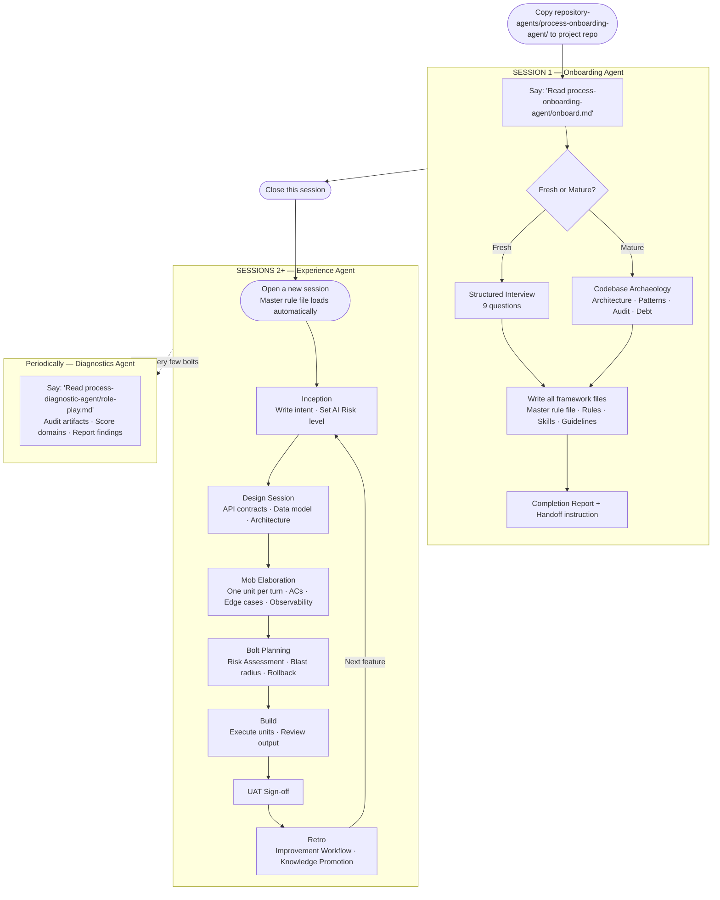
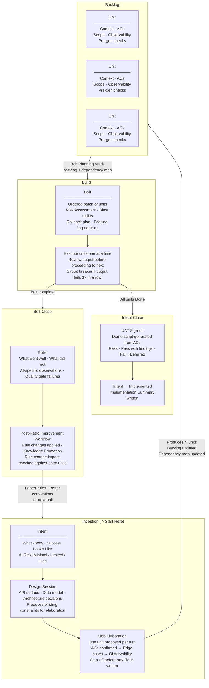

# AI-DLC Repository Agent Suite for IDEs

The canonical source of the AI-DLC framework at 99x. This repository contains everything needed to onboard, operate, and audit any software project using AI assistance — with Claude Code, Cursor, or GitHub Copilot.

---

## What Is AI-DLC?

AI-DLC is a structured operating system for building software with AI assistance. It is not a tool — it is a set of files, conventions, and ceremonies that govern how a team and its AI work together. The output is a repository where:

- Every feature starts with a written intent and testable acceptance criteria
- Every AI interaction is gated by a quality check and logged for audit
- Every failure feeds back into rules that prevent recurrence
- Any engineer (or AI tool) opening the repo knows exactly how to work in it

The process runs in three phases that form a continuous loop:

```
Inception → Build → Operate → Improvements → (back to Inception)
```

---

## What to Expect From This Repository

This repository does **not** ship a fixed set of rules that get stamped into your project.

A common first impression is that AI-DLC is a standards pack — a collection of pre-written rules and conventions that are applied uniformly across every project. That is not what happens. The files in this repository are a **framework skeleton and an agent protocol**, not a rule book.

Here is what actually gets built:

- **Your rules are written through conversation.** During onboarding, the agent interviews the team about the project's purpose, technology stack, domain language, architectural decisions, and constraints. It does not impose defaults — it listens and encodes what the team says.
- **Your skills are shaped by your context.** The mob elaboration prompts, review checklists, and quality gates generated by the agent reflect the conventions and priorities your team expressed during the interview, not a generic template.
- **Mature projects get deeper treatment.** For existing codebases, the agent reads the code first — mapping architecture, extracting real patterns, classifying existing debt — before writing a single rule. The output inherits the project's conventions rather than overwriting them.
- **The framework evolves with the project.** Every retro feeds improvements back into the rules and skills files. Over time the AI's behavior is shaped by the project's actual history, not a static configuration.

What AI-DLC *does* provide is the **master guideline** — a structured process for how that conversation happens, what questions get asked, how the outputs are organized, and how quality is enforced over time. Think of it as the methodology, and the generated files as the artifacts the methodology produces for your specific project.

The result is a governance layer that is genuinely native to your project — written in your team's language, calibrated to your stack, and tightened by your own retros.

> **Note on bolt-type skills:** The skill files `bug-bolt.md`, `hotfix-bolt.md`, and `nfr-bolt.md` are bolt-type variants within the framework — not standalone tools. They abbreviate the elaboration ceremony for specific work types (bugs, production incidents, non-functional improvements) while keeping all quality gates active. They require the full AI-DLC framework to be installed and are routed from the master rule file. Do not use them in isolation.

---

## Supported AI Tools

AI-DLC works with any of the three AI coding assistants below. The framework content is identical across all three — only the master rule file name and location differ.

| AI Tool | Master rule file | Location in project repo |
|---|---|---|
| **Claude Code** | `CLAUDE.md` | Repo root |
| **Cursor** | `.cursorrules` | Repo root |
| **GitHub Copilot** | `copilot-instructions.md` | `.github/` folder |

Each tool loads its master rule file automatically at the start of every session. The onboarding agent asks which tool the team uses and creates the correct file. Mirror files for additional tools can be created at any time — see the setup guide for instructions.

---

## Three Agentic Capabilities

This repository delivers three distinct AI agent behaviours. Each serves a different stage of a project's relationship with AI-DLC.

---

### 1. Onboarding Agent

**What it does:** Installs the AI-DLC framework into a project that does not yet have it.

**Mode:** Push — the agent drives the entire setup process and delivers a ready-to-use governance layer.

**When to use:** When a project is starting fresh or when an existing project wants to adopt AI-DLC for the first time.

**How it works:**
- For **fresh projects**: runs a nine-question structured interview to extract the project's identity, stack, domain language, and constraints, then generates all framework files from those answers.
- For **mature projects**: performs a phased codebase archaeology (architecture mapping, pattern extraction, due diligence audit, debt classification) before generating the framework, ensuring the AI inherits the existing project's conventions rather than overwriting them.

The output is a fully configured `intent-execution-framework/` folder (placed inside the team's existing docs folder, or at `docs/process/intent-execution-framework/` if none exists) with a master rule file, rules, skills, guidelines, ops templates, and a completion report flagging anything that still needs engineer input.

**Entry point:** `process-onboarding-agent/onboard.md`

---

### 2. Experience Agent

**What it does:** Governs how the AI behaves inside a project on a day-to-day basis once AI-DLC is installed.

**Mode:** Ambient — the agent is always active. It is not invoked separately; it is what the AI *becomes* once the master rule file and framework files are loaded at the start of every session.

**When to use:** Every session in an onboarded project. The experience agent is the normal working mode.

**How it works:** The master rule file (generated during onboarding) is a routing table that loads the agent's behaviour from the framework files:
- Enforces the **Prompt Quality Gate** before any code is generated
- Runs **mob elaboration** turn by turn — starting with a design session (Phase 0) to lock down API contracts and data models, then one unit at a time with ACs confirmed before edge cases, sign-off before file creation
- Runs a **bolt risk assessment** before the first unit executes — blast radius, rollback options, and feature flag requirements
- Monitors **engineer engagement** and intervenes when disengagement signals are detected
- Executes the **Post-Retro Improvement Workflow** automatically after every retro — synthesizing findings into improvement proposals, applying approved changes to rules and skills files, and running knowledge promotion to surface generic improvements for this base repo
- Conducts **UAT** at intent close — generates a plain-language demo script from ACs, walks each step, records pass/fail outcomes, and writes a sign-off before the intent is marked Implemented
- Tracks **process health** on demand — computes improvement adoption rate, quality gate failure rate, AC revision rate, and bolt velocity; saves a dated report automatically
- Prompts for a **dependency audit** when the scheduled date in Section 9 arrives — reads manifests, analyzes findings, and creates remediation bolts for critical issues
- Writes an **Implementation Summary** when all units under an intent are delivered
- Suggests running **Root Cause Analysis** when an incident is resolved
- Routes **bolt-type variants** based on natural language: "fix a bug in X" → bug bolt (abbreviated workflow, no elaboration, mandatory RCA if recurring); "hotfix" / "prod is down" → hotfix bolt (emergency intake, minimal ACs, retro within 24 hours); "improve performance of X" / "NFR bolt" → NFR bolt (measurable threshold ACs, before/after baseline, no new intent created)
- Responds to engineer-triggered skills: `compact-docs`, `root-cause-analysis`, `progress-digest` (stakeholder summaries), `new-engineer-induction` (onboards a new team member with a personalized quick-reference card)

The experience agent compounds in quality over time — every retro tightens the rules, every RCA surfaces deeper gaps, knowledge promotion propagates improvements across teams, and every bolt is safer than the last.

**Entry point:** The master rule file at the repo root (`CLAUDE.md`, `.cursorrules`, or `.github/copilot-instructions.md`)

---

### 3. Diagnostics Agent

**What it does:** Audits a project that is already running AI-DLC and identifies gaps between its current practice and AI-DLC principles.

**Mode:** Pull — the agent requests artifacts from the engineer, scores them against structured rubrics, and delivers a prioritised review report.

**When to use:** Periodically on any active AI-DLC project — after the first few bolts to validate early practice, or whenever the team suspects the process has drifted.

**How it works:** The agent adopts the role of an AI-DLC Process Reviewer and runs through eight review domains:
1. **Foundation** — is the master rule file a routing table or a wall of text? Are sections complete and accurate?
2. **Inception** — are intent files written from the user's perspective? Do elaboration sessions follow the turn structure?
3. **Build** — are ACs testable? Is scope bounded? Are pre-generation checks being run?
4. **Operate** — are retros closing the feedback loop? Are improvements actually applied to the target files?
5. **Process Adherence** — assessed through conversation, not files: is the quality gate enforced? Are ACs challenged or passively accepted?
6. **Organization & Structure** — based on where the engineer retrieves artifacts from, are like artifacts colocated, consistently named, cross-linked, and discoverable?
7. **People** — assessed through conversation: does the team demonstrate the five FDE Focused Areas (domain knowledge, customer closeness, ownership, value through expertise, and effective communication)?
8. **Tools** — assessed through conversation: what is the team's SDLC automation posture across nine pipeline stages, and where do gaps create risk for AI-DLC execution?

The agent never asks for files by specific path — the engineer shares whatever they have from wherever they keep it. The agent evaluates content quality and organizational structure independently.

The output is a comprehensive Review Report containing: a domain-by-domain scorecard, findings by severity, an Organization Assessment, a People-Process-Tools Alignment section (FDE skills profile, process adherence summary, and SDLC automation posture table with challenges and suggestions), a Gap Analysis mapping each finding to the specific AI-DLC principle violated, a Remediation Plan (Immediate / Short-term / Long-term actions, produced only when Critical or Important findings exist), a single "First Action" recommendation, and a Patterns section flagging process drift signals.

**Entry point:** `process-diagnostic-agent/role-play.md`

---

## How the Agents Work Together



---

## Artifact Lifecycle: Intents, Units, and Bolts

An **intent** describes what needs to be built and why, written from the user's perspective. Mob elaboration breaks it into **units** — atomic pieces of work, each with testable ACs. A **bolt** is a planned batch of units grouped for execution. The three artifacts are distinct: an intent captures the goal, units capture the work, and a bolt controls the delivery sequence.



---

## What Is This Repository?

This repo is the **base template** — the source of truth that gets copied into each project repo. It contains:

| File / Folder | Purpose |
|---|---|
| `repository-agents/process-onboarding-agent/setup-guide.md` | The complete framework specification. Describes every file, rule, and ceremony. |
| `repository-agents/process-onboarding-agent/onboard.md` | The bootstrap trigger. Drop this into a target repo and follow the instructions to start onboarding. |
| `repository-agents/process-onboarding-agent/skills/compact-docs.md` | Engineer-triggered skill to archive operational documents older than the project's configured threshold. |
| `repository-agents/process-onboarding-agent/skills/root-cause-analysis.md` | Skill to run 5-Whys analysis on incidents and improvements, classify root causes (Solution Design / Technology / Process), surface cross-cutting patterns, and produce linked intent or improvement artifacts. |
| `repository-agents/process-onboarding-agent/skills/design-session.md` | Phase 0 of mob elaboration. Runs at the start of every elaboration session to lock down API contracts, data models, and architectural patterns before unit decomposition begins. |
| `repository-agents/process-onboarding-agent/skills/bolt-risk-assessment.md` | Pre-bolt risk assessment. Analyzes blast radius, cross-unit sequencing risks, rollback options, and feature flag requirements before the first unit executes. Mandatory for mature projects. |
| `repository-agents/process-onboarding-agent/skills/progress-digest.md` | Stakeholder communication artifact. Translates technical progress (units, bolts, statuses) into plain-language summaries for non-technical stakeholders. |
| `repository-agents/process-onboarding-agent/skills/uat.md` | Acceptance testing protocol. Guides the engineer through UAT using the intent's ACs as the test script; records pass/fail/deferred outcomes; blocks intent from being marked Implemented without sign-off. |
| `repository-agents/process-onboarding-agent/skills/process-health.md` | Process health metrics. Computes four metrics (improvement adoption, quality gate failure rate, AC revision rate, bolt velocity) and surfaces decay signals; saves a dated health report automatically. |
| `repository-agents/process-onboarding-agent/skills/dependency-audit.md` | Monthly dependency and security posture audit. Reads manifests, classifies findings by severity, and creates remediation bolts for high/critical issues. Scheduled via Section 9 of the master rule file. |
| `repository-agents/process-onboarding-agent/skills/knowledge-promotion.md` | Cross-project learning protocol. Runs as the final step of every retro; classifies each improvement as generic (to be contributed back to this base repo) or project-specific. |
| `repository-agents/process-onboarding-agent/skills/new-engineer-induction.md` | New engineer onboarding session. Walks a new team member through the project's framework using actual project files; produces a personalized quick-reference card. |
| `repository-agents/process-onboarding-agent/skills/bug-bolt.md` | Lightweight bolt workflow for fixing a specific, reproducible bug. Triggered by "fix a bug in X". Skips design session and elaboration; replaces them with a four-question intake, recurrence check, and a single focused unit. Runs RCA automatically if the bug is recurring. |
| `repository-agents/process-onboarding-agent/skills/hotfix-bolt.md` | Emergency bolt for production incidents. Triggered by "hotfix" or "prod is down". Runs a three-question intake (symptom, severity, rollback), creates a minimal unit, mandates a retro and RCA within 24 hours. |
| `repository-agents/process-onboarding-agent/skills/nfr-bolt.md` | Non-functional quality attribute bolt. Triggered by "improve performance of X", "NFR bolt for X", etc. Requires a measurable threshold AC, establishes a before/after baseline, and cross-references affected intents. Does not create a new intent. |
| `repository-agents/process-onboarding-agent/ops/inception/dependency-map.md` | Intent dependency map. Records which intents depend on others and which interfaces are shared across intent boundaries; read before bolt planning, updated after every elaboration sign-off. |
| `repository-agents/process-onboarding-agent/rules/engagement.md` | Engineer engagement monitoring — signals of disengagement, intervention script, and escalation protocol. Copied verbatim into every project. |
| `repository-agents/process-onboarding-agent/ops/inception/intents/_template.md` | Template for writing a feature intent (includes Implementation Summary section, written when all units under the intent are delivered) |
| `repository-agents/process-onboarding-agent/ops/inception/elaborations/_template.md` | Template for logging a mob elaboration session |
| `repository-agents/process-onboarding-agent/ops/build/units/_template.md` | Template for an atomic unit of work |
| `repository-agents/process-onboarding-agent/ops/build/bolts/_template.md` | Template for a planned batch of units |
| `repository-agents/process-onboarding-agent/ops/build/backlog.md` | Starter backlog file with Reference Link Registry — all unit/bolt links use reference-style Markdown so compact-docs only updates the registry, never the table rows |
| `repository-agents/process-onboarding-agent/ops/operate/retros/_template.md` | Template for a bolt retrospective (includes Post-Retro Improvement Workflow — AI-driven, runs immediately after every retro) |
| `repository-agents/process-onboarding-agent/ops/operate/incidents/_template.md` | Template for a production incident |
| `repository-agents/process-onboarding-agent/ops/operate/improvements/_template.md` | Template for a process improvement triggered by a retro or incident |

The remaining files (most of `rules/`, all of `guidelines/`, and the master rule file) are **generated per project** by the AI agent during onboarding — they cannot be shared across projects because they encode each project's specific stack, domain, and conventions.

---

## How to Use This Repository

### Onboarding a new project

This is a two-session process. The onboarding agent runs in the first session and creates the framework. The experience agent runs in every subsequent session.

**Session 1 — Onboarding agent**

1. **Copy the `process-onboarding-agent/` folder** from `repository-agents/` in this repo into the root of your target repository.

2. **Open your AI assistant** (Claude Code, Cursor, or GitHub Copilot) inside the target repo.

3. **Say:**
   > "Read `process-onboarding-agent/onboard.md` and follow the instructions inside it."

4. The agent will ask you which AI tool you're using and whether the project is fresh or mature, then run the onboarding process end to end — including a nine-question interview (fresh projects) or a phased codebase archaeology (mature projects) — creating all framework files, populating the master rule file, and delivering a completion report.

5. **Review the completion report.** Fill in any sections the agent flagged as requiring engineer input before the first Bolt runs.

6. **Close this session.** The onboarding conversation has served its purpose. Do not continue working in it — it carries accumulated context (interview history, archaeology findings, file creation logs) that is no longer needed and will interfere with the experience agent.

**Session 2 onwards — Experience agent**

7. **Open a brand new session** inside the project repository using your AI tool. The tool will automatically load your master rule file (`CLAUDE.md` for Claude Code, `.cursorrules` for Cursor, or `.github/copilot-instructions.md` for GitHub Copilot) at the start of the session.

8. **Begin your first feature:** say `"Run a mob elaboration for [first intent name]"` — this is the experience agent's entry point. Every session from here is a normal working session governed by the master rule file.

### What the agent creates in your project repo

The onboarding agent first asks where your process documentation lives, then installs the framework at `{your-docs-folder}/intent-execution-framework/` (or `docs/process/intent-execution-framework/` if no folder exists yet). After onboarding, your target repo will contain:

```
<your-project>/
  CLAUDE.md (or .cursorrules / .github/copilot-instructions.md)
  process-onboarding-agent/        ← delete this after onboarding is complete
    onboard.md
    setup-guide.md
    rules/  skills/  ops/          ← source files used during onboarding only
  {your-docs-folder}/              ← e.g. docs/process/ or an existing docs folder
    intent-execution-framework/    ← the installed framework lives here
      rules/
        prompt-quality-gate.md
        code-standards.md
        security.md
        architecture.md
        engagement.md
      skills/
        mob-elab-prompts.md
        review-checklist.md
        compact-docs.md
        root-cause-analysis.md
        design-session.md
        bolt-risk-assessment.md
        progress-digest.md
        uat.md
        process-health.md
        dependency-audit.md
        knowledge-promotion.md
        new-engineer-induction.md
        bug-bolt.md
        hotfix-bolt.md
        nfr-bolt.md
      guidelines/
        domain-glossary.md
        edge-cases.md
        acceptance-patterns.md
        forbidden-zones.md      ← mature projects only
        entry-points.md         ← mature projects only
        dev-setup.md
        team-rollout.md
      prompts/
      ops/
        inception/intents/
        inception/elaborations/
        inception/dependency-map.md
        build/backlog.md
        build/units/
        build/bolts/
        operate/retros/
        operate/incidents/
        operate/improvements/
      Instructions2FDE.md
      README.md
```

---

## AI-DLC Reviewer (Diagnostics)

For teams already running AI-DLC, the `repository-agents/process-diagnostic-agent/` folder provides a complementary **pull** mode — a structured role-playing audit session that validates an existing project's artifacts and practice against AI-DLC principles.

| File | Purpose |
|---|---|
| `repository-agents/process-diagnostic-agent/role-play.md` | Bootstrap trigger. Copy into the target repo and read it to the AI to start a review session. |
| `repository-agents/process-diagnostic-agent/review-guide.md` | Full review protocol — eight domains, rubrics for every artifact type, scoring system, and report format. |

**How to use:**

1. Copy the `process-diagnostic-agent/` folder from `repository-agents/` in this repo into the root of the project repo being audited.
2. Open your AI assistant inside that repo.
3. Say: `"Read process-diagnostic-agent/role-play.md and follow the instructions inside it."`
4. The AI adopts the reviewer persona and runs through eight review domains — Foundation, Inception, Build, Operate, Process Adherence, Organization & Structure, People (FDE skills), and Tools (SDLC automation posture) — requesting artifacts or conducting conversations per domain, scoring against rubrics, and delivering a comprehensive report with gap analysis, a People-Process-Tools Alignment section, and a prioritised remediation plan.

The reviewer never generates code or creates files unprompted. It is a diagnostic tool, not an onboarding tool.

---

## How to Update This Repository

When any 99x project completes a retro and produces an improvement that changes a **generic rule** (one that should apply to all projects, not just that project's specific stack), bring it back here:

1. After each retro, the `process-onboarding-agent/skills/knowledge-promotion.md` skill automatically classifies each improvement as **generic** (contribute back) or **project-specific** (keep local). Check the `Knowledge promotion` field on each improvement file.
2. For improvements marked **Promoted**, open a PR against this repo.
3. Apply the change to the relevant file in `process-onboarding-agent/`.
4. Note the source project and retro in the PR description.

This is how the framework compounds across teams over time. The knowledge promotion step is mandatory at the end of every retro — no improvement is closed without a classification.

---

## Reference

- Full framework specification: [repository-agents/process-onboarding-agent/setup-guide.md](repository-agents/process-onboarding-agent/setup-guide.md)
- Agent bootstrap instructions: [repository-agents/process-onboarding-agent/onboard.md](repository-agents/process-onboarding-agent/onboard.md)
