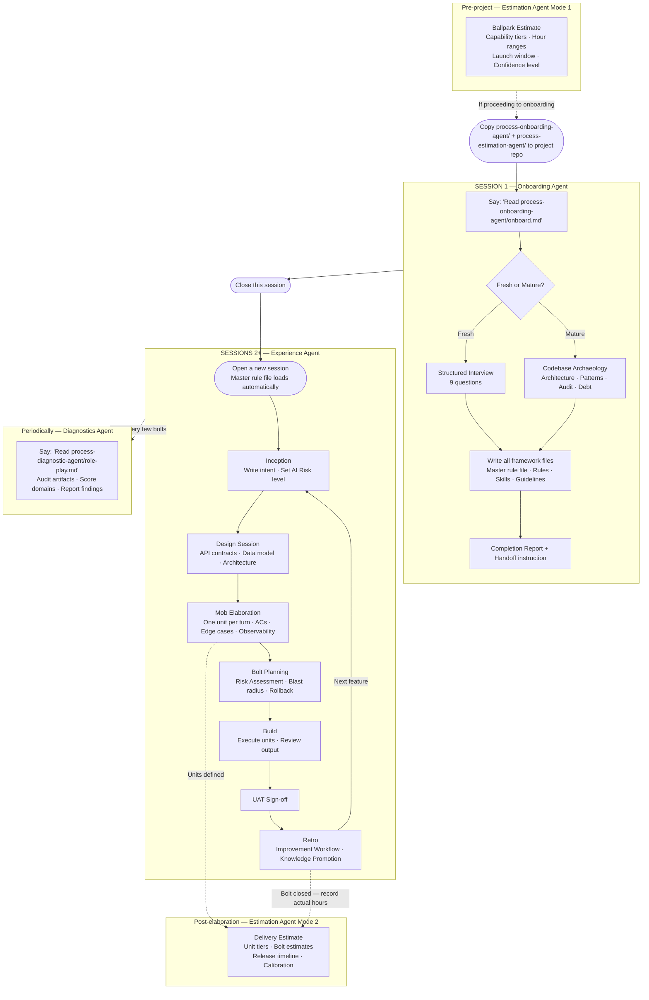
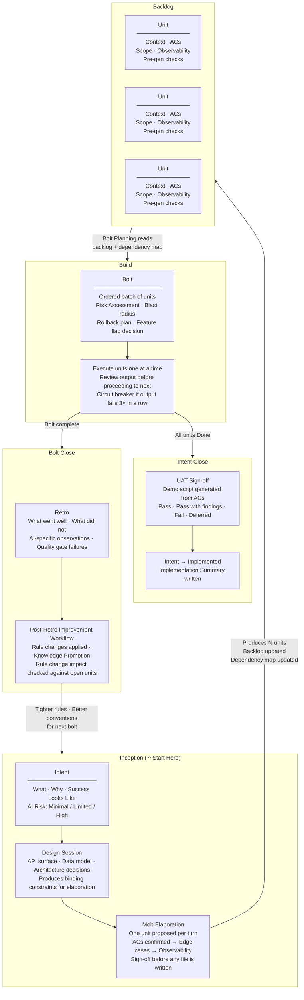

# Agent Descriptions and Diagrams

← [Back to README](../README.md)

---

## What to Expect From This Repository

This repository does **not** ship a fixed set of rules that get stamped into your project.

A common first impression is that the 99x Intent Delivery Framework is a standards pack — a collection of pre-written rules and conventions that are applied uniformly across every project. That is not what happens. The files in this repository are a **framework skeleton and an agent protocol**, not a rule book.

Here is what actually gets built:

- **Your rules are written through conversation.** During onboarding, the agent interviews the team about the project's purpose, technology stack, domain language, architectural decisions, and constraints. It does not impose defaults — it listens and encodes what the team says.
- **Your skills are shaped by your context.** The mob elaboration prompts, review checklists, and quality gates generated by the agent reflect the conventions and priorities your team expressed during the interview, not a generic template.
- **Mature projects get deeper treatment.** For existing codebases, the agent reads the code first — mapping architecture, extracting real patterns, classifying existing debt — before writing a single rule. The output inherits the project's conventions rather than overwriting them.
- **The framework evolves with the project.** Every retro feeds improvements back into the rules and skills files. Over time the AI's behavior is shaped by the project's actual history, not a static configuration.

What AI-DLC *does* provide is the **master guideline** — a structured process for how that conversation happens, what questions get asked, how the outputs are organized, and how quality is enforced over time. Think of it as the methodology, and the generated files as the artifacts the methodology produces for your specific project.

The result is a governance layer that is genuinely native to your project — written in your team's language, calibrated to your stack, and tightened by your own retros.

> **Note on bolt-type skills:** The skill files `bug-bolt.md`, `hotfix-bolt.md`, and `nfr-bolt.md` are bolt-type variants within the framework — not standalone tools. They abbreviate the elaboration ceremony for specific work types (bugs, production incidents, non-functional improvements) while keeping all quality gates active. They require the full AI-DLC framework to be installed and are routed from the master rule file. Do not use them in isolation.

---

## Core Agent Descriptions

### 1. Onboarding Agent

**What it does:** Installs the 99x Intent Delivery Framework into a project that does not yet have it.

**Mode:** Push — the agent drives the entire setup process and delivers a ready-to-use governance layer.

**When to use:** When a project is starting fresh or when an existing project wants to adopt the 99x Intent Delivery Framework for the first time.

**How it works:**
- For **fresh projects**: runs a nine-question structured interview to extract the project's identity, stack, domain language, and constraints, then generates all framework files from those answers.
- For **mature projects**: performs a phased codebase archaeology (architecture mapping, pattern extraction, due diligence audit, debt classification) before generating the framework, ensuring the AI inherits the existing project's conventions rather than overwriting them.

The output is a fully configured `intent-execution-framework/` folder (placed inside the team's existing docs folder, or at `docs/process/intent-execution-framework/` if none exists) with a master rule file, rules, skills, guidelines, ops templates, and a completion report flagging anything that still needs engineer input. This is the installed 99x Intent Delivery Framework for the project.

**Entry point:** `process-onboarding-agent/onboard.md`

---

### 2. Experience Agent

**What it does:** Governs how the AI behaves inside a project on a day-to-day basis once AI-DLC is installed.

**Mode:** Ambient — the agent is always active. It is not invoked separately; it is what the AI *becomes* once the master rule file and framework files are loaded at the start of every session.

**When to use:** Every session in an onboarded project. The experience agent is the normal working mode.

**How it works:** The master rule file (generated during onboarding) is a routing table that loads the agent's behavior from the framework files:
- Enforces the **Prompt Quality Gate** before any code is generated
- Runs **mob elaboration** in the engineer's chosen mode — **Interactive** (one unit proposed per turn, ACs confirmed before edge cases, sign-off before files are created) or **Plan-first** (complete elaboration plan drafted as a markdown document first, engineer reviews and refines, then signs off). Both modes start with a design session (Phase 0) to lock down API contracts and data models before any units are proposed.
- Runs a **bolt risk assessment** before the first unit executes — blast radius, rollback options, and feature flag requirements
- Monitors **engineer engagement** and intervenes when disengagement signals are detected
- Executes the **Post-Retro Improvement Workflow** automatically after every retro — synthesizing findings into improvement proposals, applying approved changes to rules and skills files, and running knowledge promotion to surface generic improvements for this base repo
- Conducts **UAT** at intent close — generates a plain-language demo script from ACs, walks each step, records pass/fail outcomes, and writes a sign-off before the intent is marked Implemented
- Tracks **process health** on demand — computes improvement adoption rate, quality gate failure rate, AC revision rate, and bolt velocity; saves a dated report automatically
- Prompts for a **dependency audit** when the scheduled date in Section 9 arrives — reads manifests, analyzes findings, and creates remediation bolts for critical issues
- Writes an **Implementation Summary** when all units under an intent are delivered
- Suggests running **Root Cause Analysis** when an incident is resolved
- Routes **bolt-type variants** based on natural language: "fix a bug in X" → bug bolt (abbreviated workflow, no elaboration, mandatory RCA if recurring); "hotfix" / "prod is down" → hotfix bolt (emergency intake, minimal ACs, retro within 24 hours); "improve performance of X" / "NFR bolt" → NFR bolt (measurable threshold ACs, before/after baseline, no new intent created)
- Responds to engineer-triggered skills: `compact-docs`, `root-cause-analysis`, `progress-digest` (stakeholder summaries), `new-engineer-induction` (onboards a new team member with a personalized quick-reference card)

The experience agent compounds in quality over time — every retro tightens the rules, every RCA surfaces deeper gaps, knowledge promotion propagates improvements across teams, and every bolt is safer than the last.

**Entry point:** The master rule file at the repo root (`CLAUDE.md`, `.cursorrules`, or `.github/copilot-instructions.md`)

---

### 3. Diagnostics Agent

**What it does:** Audits a project against AI-DLC principles and delivers a structured gap report. Works whether or not the 99x Intent Delivery Framework is installed — the agent works with whatever process artifacts the team already has.

**Mode:** Pull — the agent requests artifacts from the engineer, scores them against structured rubrics, and delivers a prioritised review report.

**When to use:**
- **Before onboarding** — run it against your current process (Jira tickets, PR descriptions, retro notes, incident records) to get a gap report that shows exactly what is missing and why. The output becomes the brief for your onboarding session.
- **After onboarding** — periodically, after the first few bolts to validate early practice, or whenever the team suspects the process has drifted.

The `process-onboarding-agent/` folder does not need to be present. The agent never reads from it.

**How it works:** The agent confirms the review scope before starting, then adopts the role of an AI-DLC Process Reviewer. Six process domains always run; two are optional and selected by the engineer at the start of the session:

**Always included:**
1. **Foundation** — is the master rule file a routing table or a wall of text? Are sections complete and accurate?
2. **Inception** — are intent files written from the user's perspective? Do elaboration sessions follow the turn structure?
3. **Build** — are ACs testable? Is scope bounded? Are pre-generation checks being run?
4. **Operate** — are retros closing the feedback loop? Are improvements actually applied to the target files?
5. **Process Adherence** — assessed through conversation: is the quality gate enforced? Are ACs challenged or passively accepted?
6. **Organization & Structure** — assessed passively from the locations the engineer provides artifacts from.

**Optional (selected at session start):**
7. **People** — Forward Deployed Engineer (FDE) skills assessment across five capability areas, conversation-based. Can be run for a single team member or for multiple team members individually, producing both per-person profiles and a team aggregate.
8. **Tools** — SDLC automation posture across nine pipeline stages, conversation-based; produces a classified automation tier table with gap challenges and suggestions.

The agent never asks for files by specific path — the engineer shares whatever they have from wherever they keep it. The agent evaluates content quality and organizational structure independently.

The output is a comprehensive Review Report containing: a domain-by-domain scorecard, findings by severity, an Organization Assessment, a People-Process-Tools Alignment section (FDE skills profile, process adherence summary, and SDLC automation posture table with challenges and suggestions), a Gap Analysis mapping each finding to the specific AI-DLC principle violated, a Remediation Plan (Immediate / Short-term / Long-term actions, produced only when Critical or Important findings exist), a single "First Action" recommendation, and a Patterns section flagging process drift signals.

**Entry point:** `process-diagnostic-agent/role-play.md`

---

## Supporting Agents

### 4. Skills Agent

**What it does:** Installs individual skills from the 99x Intent Delivery Framework into a project that uses its own bespoke AI delivery process — without installing the full framework. No master rule file, no governance structure, no process change.

**Mode:** Push — the agent interviews the team, presents a curated skills catalogue with dependency classifications, and copies the selected skills to a location of the team's choosing.

**When to use:** When a team has a working AI-assisted delivery process and wants to add specific framework capabilities — design sessions, risk assessments, UAT, root cause analysis — without adopting the full governance layer.

**How it works:**
- Runs a five-question discovery interview about the team's current process, AI touchpoints, common failure modes, stakeholder communication, and capability gaps
- Presents the full skills catalogue (15 skills grouped by delivery moment) with a dependency classification for each: **Standalone** (invoke directly), **Needs config** (one small configuration at invocation), or **Framework-only** (requires the full framework)
- Flags skills most relevant to the team's answers with a ★ Recommended marker
- Engineer selects skills; agent warns before installing any Framework-only skills
- Copies selected skill files to the team's chosen path
- Writes an Adoption Card — a single reference document listing each installed skill, how to invoke it, and what it produces

**Entry point:** `process-skills-agent/onboard.md`

---

### 5. Migration Agent

**What it does:** Migrates a project from the old `ai-dlc/` structure (used before June 2026) to the new methodology, moving all three agents in one session.

**Mode:** Push — the agent scans the old structure, presents a pre-flight summary, confirms the plan with the engineer, moves all files, updates path references, and delivers a migration report. All operational data is preserved.

**When to use:** When a project used the old `ai-dlc/` folder as both bootstrap agent and installed framework, with `ai-dlc-reviewer/` as the diagnostic agent.

**How it works:**
- Pre-flight scan detects old files and classifies them: **Generated** (project-specific, move and preserve), **Template** (move then refresh from new base), **Bootstrap-only** (discard, replaced by new agent), **Diagnostic bootstrap** (discard, replaced by new agent)
- Confirms the new `FRAMEWORK_ROOT` path with the engineer
- Moves generated framework files (rules, skills, guidelines, ops data) to the new `intent-execution-framework/` location
- Updates the master rule file: replaces all `ai-dlc/rules/`, `ai-dlc/skills/`, `ai-dlc/guidelines/`, `ai-dlc/ops/` path references with the new `{FRAMEWORK_ROOT}/` equivalents
- Replaces `ai-dlc-reviewer/` with the new `process-diagnostic-agent/` (which adds Trend Analysis capability)
- Delivers a migration report; removes `ai-dlc/` and `ai-dlc-reviewer/` only after all conditions are verified

**Entry point:** `process-migration-agent/migrate.md`

---

### 6. Estimation Agent

**What it does:** Produces structured estimates for AI-assisted delivery projects. Operates in two modes depending on project stage — a ballpark mode for pre-sales and financial feasibility, and a delivery mode for bolt-level release and sprint planning.

**Mode:** Depends on mode selected — Mode 1 is Push (agent structures requirements and computes ranges); Mode 2 is Pull (agent reads elaborated units from the backlog).

**When to use:**
- **Mode 1 — Ballpark:** before mob elaboration, when requirements are brief or draft and a client needs a range estimate for financial feasibility or launch window planning
- **Mode 2 — Delivery:** after mob elaboration, when units are defined and the team needs bolt-level estimates for release planning and stakeholder communication

**How it works:**

*Mode 1:* The agent collects brief requirements and four context questions (deployment target, integration count, team AI experience, greenfield vs extension). It structures the requirements into 5–10 capability areas, classifies each as Tier A (AI-Accelerated), Tier B (Mixed), or Tier C (Human-Led), then applies modifiers for team experience and integration complexity. Output: min/expected/max hour ranges, a three-scenario delivery timeline (earliest/expected/latest) for one or more team sizes, a confidence level with reasoning, and the top three risk factors. Writes a ballpark estimate artifact to `estimates/` in the current working directory.

*Mode 2:* The agent reads the project backlog and classifies each unit by effort tier — Simple (1–3 hrs), Standard (3–6 hrs), Complex (6–14 hrs), or Spike (2–5 hrs). It sums estimates per bolt, adds 20% overhead and a 10% QA buffer for Complex units, then maps bolt durations to a release timeline given team size and working capacity. As bolts close, the engineer records actual hours; after three bolts the agent computes a calibration modifier and adjusts all remaining open estimates. Writes a delivery estimate artifact to `{FRAMEWORK_ROOT}/ops/inception/estimates/`.

**Entry point:** `process-estimation-agent/estimate.md`

---

## How the Agents Work Together

---

## Artifact Lifecycle: Intents, Units, and Bolts

An **intent** describes what needs to be built and why, written from the user's perspective. Mob elaboration breaks it into **units** — atomic pieces of work, each with testable ACs. A **bolt** is a planned batch of units grouped for execution. The three artifacts are distinct: an intent captures the goal, units capture the work, and a bolt controls the delivery sequence.

