# Skill: Process Visualization

**Purpose:** Reconstruct how a bolt (or a whole intent) actually got delivered — not the plan written before build started, but what really happened: when units really moved through their statuses, where things stalled or got reordered, and how the retro-and-improvement loop closed. Renders the reconstruction as Mermaid diagrams so the team has a shared, factual picture to react to, instead of relying on memory.

Bolt files record a plan (`Execution Order`, `Start date`, `Target date`). This skill produces the *actual* counterpart — grounded in status history where it is available, and in the recorded artifact dates where it isn't. It never fabricates timing data it cannot support.

**Trigger:** Runs at the developer's discretion — recommended, not mandatory. The AI should offer it at the start of every retro, before "What Went Well" is discussed, the same way `solution-shaping.md` is offered before design sessions: propose it, let the engineer accept, skip, or run it later. It can also be invoked directly at any time, outside a retro, to review delivery history for an intent:

> "Read `process-onboarding-agent/skills/process-visualization.md` and visualize how [bolt/intent name] actually went."

**Never run without the engineer's go-ahead.** Retros are engineer-paced, and so is this.

**Output:** Two Mermaid diagrams (an actual delivery timeline and an actual execution path), a plan-vs-actual deviation table, and a short narrative — written into the "Delivery Flow (What Actually Happened)" section of the bolt's retro file at `process-onboarding-agent/ops/operate/retros/YYYY-MM-DD-<unix_timestamp>-[bolt-slug].md`. If the retro file does not exist yet, create it from the template first, then populate this section before the retro discussion continues.

---

## Step 1 — Identify the Scope

Ask the engineer (skip if already stated):

> "Which bolt should I visualize? Or name the intent if you want the full delivery history across all its bolts."

Read, in full, everything within scope before building anything:

| Artifact | What to extract |
|---|---|
| Bolt file(s) in scope | Status, Start/Target/Completed dates, Units table, Execution Order (the plan), Retrospective link |
| Every unit linked from those bolts | Status, Dependencies table, Notes |
| The intent the bolt(s) deliver | Elaboration Sessions table, Extracted Units table |
| Elaboration session file(s) | Session date |
| Prior retro + improvement files under the same intent (multi-bolt intents only) | Date, Improvements Triggered table, Applied dates — these show the loop feeding into later bolts |

Do not ask for files individually — read everything in scope in one pass.

---

## Step 2 — Reconstruct the Actual Timeline

**Primary source — git history.** If the project is a git repository, run `git log --follow --format="%ad|%h|%s" --date=short -- [file path]` against every unit and bolt file in scope, then diff consecutive revisions of each file to find the commits where the `Status:` line changed value. This produces ground truth: the date a unit actually moved Open → In Progress, In Progress → Blocked, Blocked → In Progress, → Done, and the date a bolt's own `Status:` field changed. Build this per file before moving to the next.

**Fallback — recorded dates only.** If git history is unavailable (not a git repo, history squashed, files never committed individually, or the engineer says not to bother), fall back to the dates already recorded in the artifacts: bolt Start/Target/Completed dates, elaboration session dates, retro date, improvement Applied dates. State plainly which mode was used before presenting any diagram — **never let a diagram imply per-unit precision the underlying data doesn't support.** In fallback mode, Diagram 1 collapses to bolt-level granularity (see Step 4).

Whichever source is used, build a chronological event list first, and get engineer confirmation that it looks right before turning it into diagrams:

```
[date] Elaboration session N held
[date] Unit [name] entered In Progress
[date] Unit [name] entered Blocked — [reason, from the Dependencies table or Notes if stated; "reason not recorded" if not]
[date] Unit [name] returned to In Progress
[date] Unit [name] marked Done
[date] Bolt marked Done
[date] Retro held
[date] Improvement [name] applied
```

---

## Step 3 — Diagram 1: Actual Delivery Timeline (Mermaid `gantt`)

Render the event list as a `gantt` chart with three sections: Elaboration, Build, Retro & Follow-up. Use these tag conventions consistently — they are the only way Mermaid's gantt syntax can carry a status signal, so treat them as a fixed legend rather than literal critical-path analysis:

- `done` — unit or activity is complete
- `active` — still open/in progress as of today
- `crit` — flag any unit that spent time Blocked, or ran markedly longer than the bolt's median unit duration — this marks a deviation worth discussing, not a scheduling critical path
- `milestone` — zero-duration events (retro date, sign-off)

```mermaid
gantt
    title Actual Delivery Timeline — [Bolt or Intent name]
    dateFormat  YYYY-MM-DD
    axisFormat  %b %d

    section Elaboration
    Session 1 (units agreed)        :done, elab1, 2026-06-02, 1d

    section Build
    Unit: Add booking form          :done, u1, 2026-06-04, 2026-06-05
    Unit: Validate booking slot     :crit, done, u2, 2026-06-05, 2026-06-09
    Unit: Send confirmation email   :done, u3, 2026-06-09, 2026-06-10

    section Retro & Follow-up
    Retrospective                   :milestone, retro1, 2026-06-11, 0d
    Improvement: tighten AC gate    :done, imp1, 2026-06-12, 1d
```

**Fallback mode (no git history):** collapse Build to one bar per bolt spanning Start date → Completed date (or → today, tagged `active`, if not yet Done), instead of one bar per unit. Say so directly above the diagram: "Unit-level timing isn't available for this bolt — showing bolt-level actuals only."

---

## Step 4 — Diagram 2: Actual Execution Path (Mermaid `flowchart`)

Render the real sequence — including detours — as a left-to-right flowchart. Represent a Blocked or Deferred period as its own note node between the two units it separates, rather than a self-loop, so the reason is legible at a glance. Use `classDef` for status coloring, applied consistently:

```mermaid
flowchart LR
    classDef done fill:#2ecc71,color:#fff
    classDef blocked fill:#e74c3c,color:#fff
    classDef inprogress fill:#f1c40f,color:#000
    classDef deferred fill:#95a5a6,color:#fff
    classDef note fill:none,stroke-dasharray: 3 3

    Elab[Elaboration Session 1] --> U1[Unit: Add booking form]:::done
    U1 --> U2[Unit: Validate booking slot]:::done
    U2 --> Block1["⏸ Blocked 3 days — waiting on payments API contract"]:::note
    Block1 --> U3[Unit: Send confirmation email]:::done
    U3 --> Bolt[Bolt: Booking MVP — Done]:::done
    Bolt --> Retro[Retro held 2026-06-11]
    Retro --> Imp1[Improvement: tighten AC gate — Applied]
    Imp1 --> KP{Knowledge Promotion}
    KP -->|Generic| PR[PR drafted against ai-dlc-base]
    KP -->|Project-specific| Local[Stays local]
```



If the intent spans multiple bolts, chain each bolt's terminal node into the next bolt's first unit, so the diagram reads as one continuous delivery, not disconnected fragments.

---

## Step 5 — Plan vs. Actual Deviation Table

Compare the bolt's recorded `Execution Order` block (the plan) against the order derived in Step 2 (what actually happened). Produce one row per unit whose actual position, duration, or path diverged from the plan:

| Planned order | Actual order | Deviation |
|---|---|---|
| Unit A → Unit B → Unit C | Unit A → Unit C → Unit B | B ran last — blocked 3 days waiting on payments API contract |

If the bolt has a Target date and a Completed date, add one line stating the variance in days (reuse the framing from `process-health.md` Metric 4 — positive means late, negative means early). If nothing diverged from plan, write "No deviations — delivered as planned" instead of an empty table.

---

## Step 6 — Present for Review

Before writing anything, present the event list, both diagrams, and the deviation table in the conversation:

> "Here is how [bolt/intent name] actually went, reconstructed from [git history / recorded artifact dates]. Review it before I save it into the retro — does this match what the team remembers, or is something missing from the record?"

Wait for the engineer to confirm or correct. If the reconstructed data is wrong (e.g. a status change wasn't reflected in a commit, or a blocked period wasn't noted anywhere), apply the correction the engineer gives and note in the output that this detail came from the engineer's recollection, not the recorded artifacts.

---

## Step 7 — Write to the Retro File

If the retro file for this bolt does not exist yet, create it from `process-onboarding-agent/ops/operate/retros/_template.md` first (Bolt link, Date = today, Participants = ask).

Write the confirmed content into the retro's "Delivery Flow (What Actually Happened)" section, in this order: the reconstruction-mode statement (git history or fallback), Diagram 1, Diagram 2, the deviation table. If the section already has content from a prior run, ask before overwriting — a retro in progress may have team notes added around it that a silent overwrite would destroy.

Confirm:

```
Delivery flow written.

File: process-onboarding-agent/ops/operate/retros/YYYY-MM-DD-<unix_timestamp>-[bolt-slug].md
Section: Delivery Flow (What Actually Happened)
Reconstruction mode: [Git history / Recorded artifact dates only]
Deviations found: [N] (or "None — delivered as planned")

Use this as the factual anchor for "What Went Well" and "What Didn't Go Well" below it.
```
